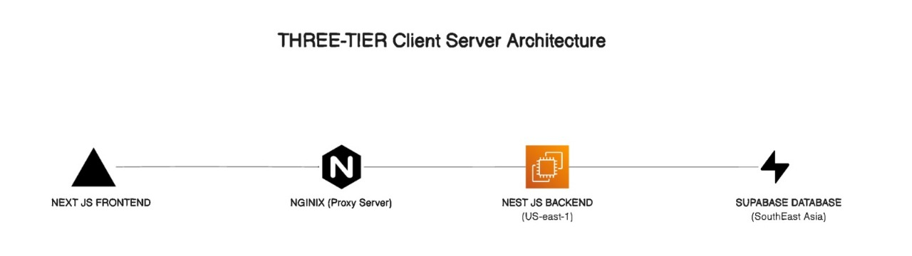

# ⚖️ Verdict AI

Welcome to **Verdict AI**, an intelligent, three-tier AI-based assessment platform engineered to streamline and enhance the quiz/test experience for learners, educators, and administrators alike. Our platform utilizes a powerful blend of modern frontend, scalable backend, and distributed database architecture to deliver seamless performance.

---

## 🏗️ Architecture Overview

Verdict AI is built on a **Three-Tier Client Server Architecture**:




---

## 🚀 Tech Stack

| Layer        | Technology            |
|--------------|-----------------------|
| **Frontend** | Next.js               |
| **Proxy**    | NGINX                 |
| **Backend**  | NestJS (TypeScript)   |
| **Database** | Supabase (PostgreSQL) |
| **ORM**      | TypeORM               |
| **Hosting**  | Vercel & AWS          |
| **Versioning** | Git + GitHub        |

---

## 🧠 Core Features

- 🎯 User-specific test generation
- ✅ Accurate option handling and correctness validation
- 🔒 Auth system integrated with Supabase
- 📊 Result tracking and feedback
- ✨ Clean, modern UI with fast response times

---

## 🗃️ Database Schema Highlights

- **Users Table** — Authentication and user metadata
- **Courses Table** — Stores information about the courses
- **Tests Table** — Stores each test instance
- **Questions Table** — Linked to specific tests
- **Options Table** — Stores multiple choice options
- **Quizzes Table** — Stores information about the quizzes
- **Lesson Table** — Stores information about the lessons
- **User-Course Table** — Bridge table for user and course

> 📌 Note: Schema is designed to reduce redundancy and improve relational consistency. Passwords are securely hashed.

---

## 🛠️ Setup Instructions

1. **Clone the Repository**  
   ```bash
   git clone https://github.com/MuhammadAbyaz/verdict-ai.git
   cd verdict-ai


🤝 Contributors
We proudly acknowledge the amazing efforts of our team:

👨‍💻 Awwab – AI & Frontend

🧠 Abyaz – Backend & Cloud Architecture

🔍 Rayyan – Database

🛠️ Talha – Frontend
